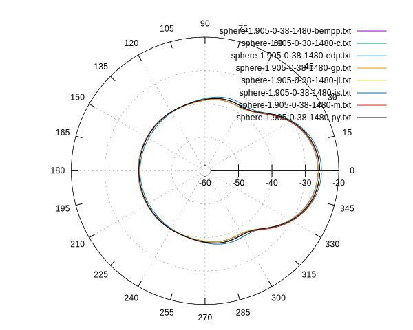
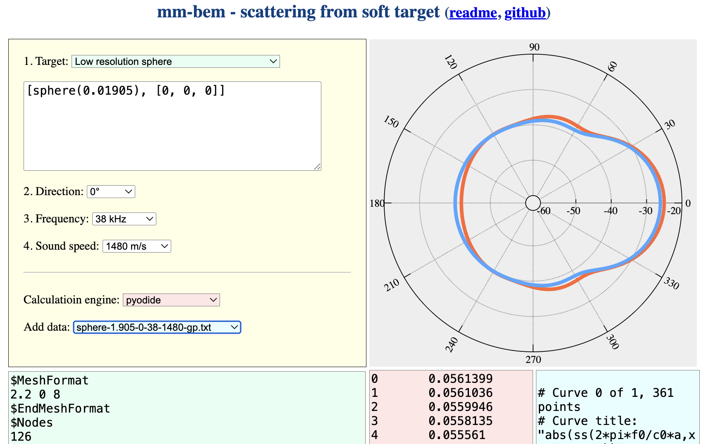

## Minimalistic bem code for plane wave scattering from soft targets 
### MM 3.8.2025

mm-bem contains collection of several source codes for calculating scattering pattern obtained when plane wave scatters from soft targets. It uses boundary element method with piecewise constant discontinuous finite elements in 3D (P0).

Calling convension depends on the code language but usually it uses four parameters:

1. mesh file name in msh ascii 2.2 format (defaults to sphere-1.905-600.msh representing 1.905cm radius sphere defined with 600 points and 1196 triangles)
2. direction angle (defaults to $$\theta$$ = 0 what means that it travels along x axis)
3. frequency (defaults to $$f$$ = 38kHz)
4. sound speed (defaults $$c$$ = 1480m/s)

The most often results are printed into standard output in the form of two-column data containing:

1. scattering angle in degrees 
2. absolute value of scattering length.  

This output data could be redirected to txt file or piped to plotting software. The polar scattering strength in logarithmic domain could be obtained by gnuplot polar.gp script. The target strength is the value calculated at  $$180^{\circ}$$ distance from wave direction angle. 

The source codes are in C, Python, Matlab, Julia and FreeFem. The theoretical calculations for a soft sphere are in Gnuplot. The example results are for 38kHz. The usege of source codes requires installating its evironments or comilers. Only FreeFem version uses Hmatrix approach that allows for faster calculations for large meshes. 

The package contains also the demonstration page that do not need any addition installation. The page allows generating sphere, spheroid or ellipsoid meshes and calculate scattering pattern for them. Moreover, it can present the results in polar form of calculated data along with other data file that could be added for comparison.

### Shell script

The run.sh script shows software versions used and calling examples generating results for 38kHz (default frequency) on MacBookPro M1 2021 Sequoia 15.5. 

```
bash-3.2$ ./run.sh
#!/bin/bash -v

gcc --version
Apple clang version 17.0.0 (clang-1700.0.13.5)
Target: arm64-apple-darwin24.5.0
Thread model: posix
InstalledDir: /Library/Developer/CommandLineTools/usr/bin
julia --version
julia version 1.10.7
python3 --version
Python 3.13.3
freefem++-mpi
freefem++-mpi - version 4.15 (Fri May  2 13:38:38 CEST 2025 - git v4.15-testActions-205-g231a620cf) 64bits
License: LGPL 3+ (https://www.gnu.org/licenses/lgpl-3.0.en.html)
...

gnuplot --version
gnuplot 6.0 patchlevel 2

gcc src/soft.c -O3 -ffast-math -o bin/soft
time ./bin/soft msh/sphere-1.905-600.msh > out/sphere-1.905-0-38-1480-c.txt

real	0m0.658s
user	0m0.498s
sys	0m0.005s
time julia src/soft.jl msh/sphere-1.905-600.msh > out/sphere-1.905-0-38-1480-jl.txt

real	0m1.881s
user	0m2.933s
sys	0m1.405s
time python3 src/soft.py msh/sphere-1.905-600.msh > out/sphere-1.905-0-38-1480-py.txt

real	0m4.663s
user	0m4.461s
sys	0m0.078s
time freefem++-mpi -v 0 -f src/soft.edp > out/sphere-1.905-0-38-1480-edp.txt

real	0m6.452s
user	0m6.379s
sys	0m0.044s
time gnuplot -c src/soft.gp > out/sphere-1.905-0-38-1480-gp.txt

real	0m0.061s
user	0m0.044s
sys	0m0.007s

cd out
gnuplot -p -c ../bin/polar.gp sphere-1.905-0-38-1480*.txt
qt.qpa.fonts: Populating font family aliases took 56 ms. Replace uses of missing font family "Sans" with one that exists to avoid this cost. 
mv polar.svg ../figs/sphere-1.905-0-38-1480.svg
mv polar.pdf ../figs/sphere-1.905-0-38-1480.pdf

gnuplot -p -c ../bin/polar.gp YFT*.txt
qt.qpa.fonts: Populating font family aliases took 58 ms. Replace uses of missing font family "Sans" with one that exists to avoid this cost. 
mv polar.svg ../figs/YFT-0-38-1480.svg
mv polar.pdf ../figs/YFT-0-38-1480.pdf
cd ..
bash-3.2$ 
```

### Results


Fig. 1. The results for soft sphere with radius of $$a=1.905$$ cm in salt water $$c_0=1480$$ m/s at 38kHz.


Fig. 2. The results for vacuum filled YFT swimbladder in salt water $$c_0=1480$$ m/s at 38kHz 


Fig. 3. The screendump from mm-bem web-page for low resolution mesh of 1.905 cm radius sphere along with theoretical curve for soft sphere in salt water $$c_0=1480$$ m/s at 38kHz.
